# This is still work in progress - parts may not make sense yet

# Sending & receiving encrypted files on macOS - a beginners guide

<!-- toc -->

- [Introduction](#introduction)
- [Overview of how encryption works](#overview-of-how-encryption-works)
- [Install GPG tools](#install-gpg-tools)
- [How to send your public key to somebody](#how-to-send-your-public-key-to-somebody)
- [What to do when you receive a public key](#what-to-do-when-you-receive-a-public-key)
- [Working with files](#working-with-files)
  * [How to encrypt a file](#how-to-encrypt-a-file)
  * [How to decrypt an encrypted file](#how-to-decrypt-an-encrypted-file)
  * [Extra Credit: Encrypt/decrypt text without having to create a file](#extra-credit-encryptdecrypt-text-without-having-to-create-a-file)

<!-- tocstop -->

## Introduction

This guide is for humans who want to exchange encrypted files. This is a guide for beginners. We cover just enough for a reader to be able to confidently send and receive and encrypted files.

## Overview of how encryption works

TODO

## Install GPG tools

Our first step to being able to confidently work with encrypted files is to download _GPG Tools_ from <https://gpgtools.org/>. _GPG Tools_ is a collection of tools that will integrate with macOS and let us encrypt and decrypt files.

Advanced users may enjoy knowing that _GPG Tools_ is a wrapper around [GnuPG](https://www.gnupg.org/). _GPG Tools_ installs _GnuPG_ (`gpg (GnuPG/MacGPG2) 2.0.30` as of this writing) and it keeps your keys etc. in `$HOME/.gnupg` just as _GnuPG_ would. Less advanced users can sleep soundly knowing that they don't need to know any of that.

The installation of _GPG Tools_ is similar to other macOS apps. Follow the prompts until we get to the screen asking you to "Generate a new key pair".

If you are confident installing macOS software you can skip straight ahead to the "Generate a key pair" screen. Otherwise you can see below a preview of what you are likely to see during installation. Don't worry if what you see does not match these exactly (_GPG Tools_ may change their installer over time) - the important details will remain the same.

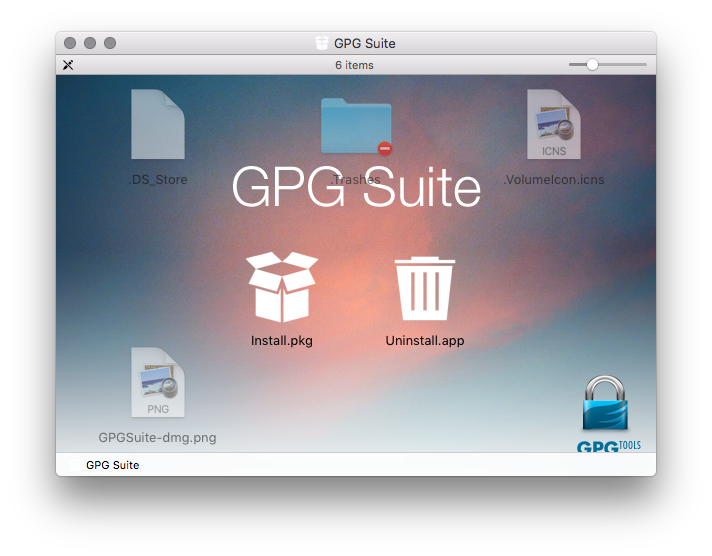
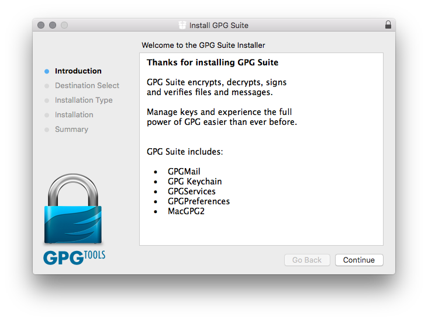
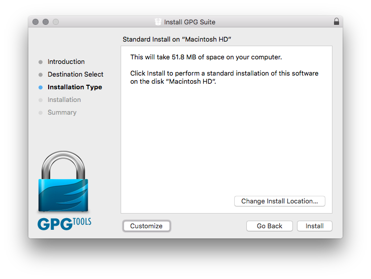
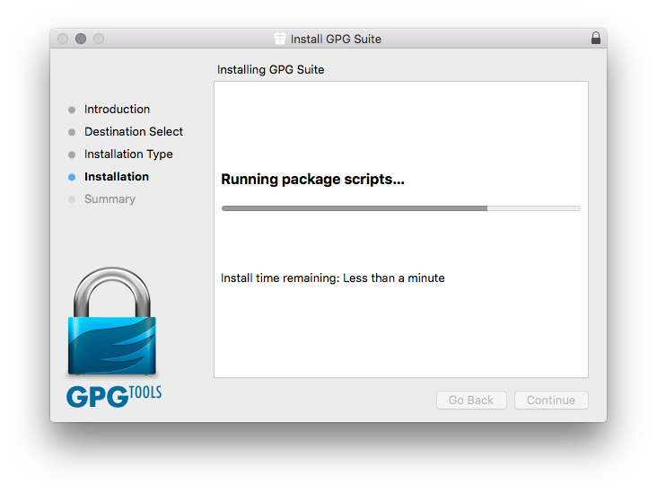

The "Generate a new key pair" screen is important for us to understand. We are going to pause here to ensure we understand what is going on in this screen.

_GPG Tools_ will probably auto-fill a name and email address for you. This name and email address will be the identity which is part of your key pair. You should use a real email address.

Leave the "Upload public key" unticked.

Uploading your public key to a keyserver can help others find it provided they are able to use encryption software such as GPG tools but it is completely optional.

Before you upload a key to a keyserver you should generate a thing called a "Certificate revocation" which will allow you to prove that the key is yours should you ever want to delete it. This is a somewhat advanced topic so to keep things simple we are not going to deal with keyservers in this guide. Once you become comfortable with the basics of sending and receiving encrypted messages you may wish to explore using a keyserver on your own - you can upload your key to a keyserver at any time via the _GPG Keychain_ interface.

Choose a good password which you will remember. _GPG tools_ will complain if your password is too simple. You will be asked for this password **every** time you encrypt or decrypt a file so it is important.

<!-- 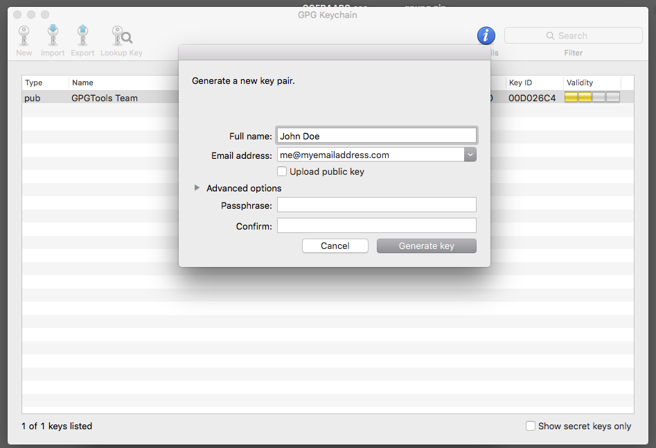 -->
<!-- 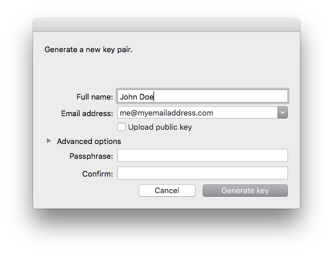 -->
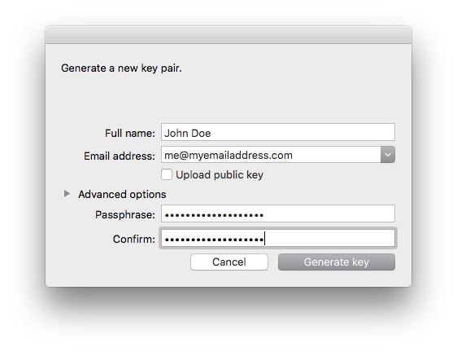

While _GPG Tools_ is generating the key it may ask you to move your mouse around. This seems pretty weird at first but for technical reasons we won't go into just now _GPG Tools_ needs some random data to make your key pair. On the upside you get to wiggle your mouse like crazy for a good cause.

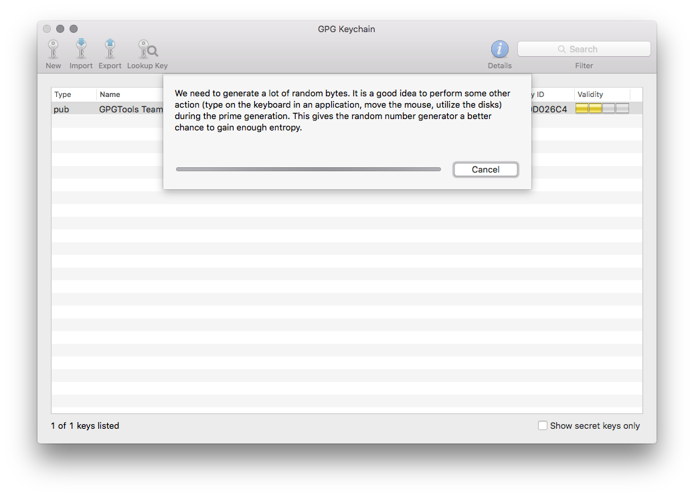
<!-- 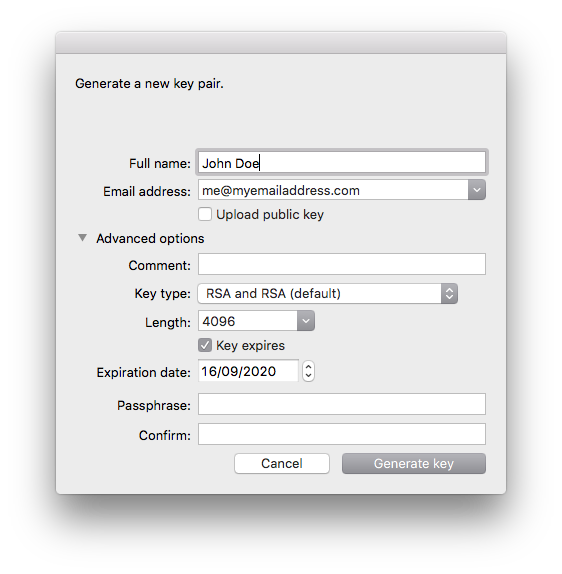 -->

Once the key has been created you will see it in your list of keys. When you have both the public and private part of a particular key _GPG Tools_ shows the key in **bold** and shows **sec/pub** in the _Type_ column. Private keys are sometimes also called _secret keys_ and this is the terminology that _GPG Tools_ is referencing with the "sec" phrase.

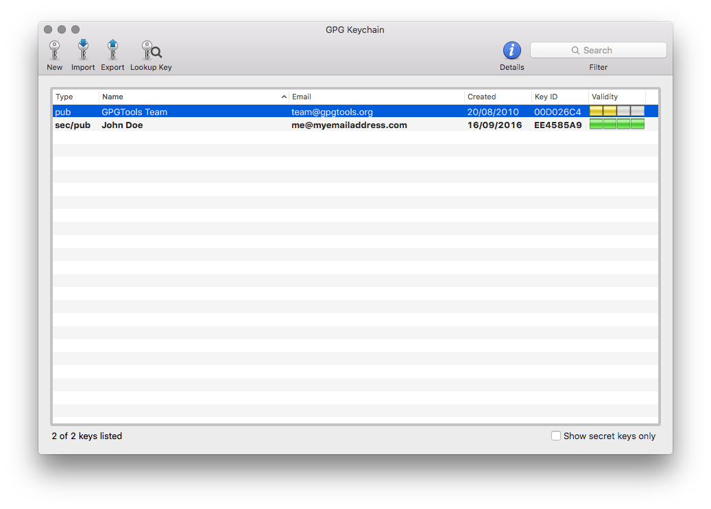

## How to send your public key to somebody

If you want to email your public key to somebody there is a very fast way:

1. Right-click on your keypair in the "GPG Keychain" window
1. Choose "Mail public key"
1. Your email software should open with a new email filled in with your public key as an attachment

If you want to save your public key as a file on your hard disks then:

1. Right-click on your keypair in the "GPG Keychain" window
1. Choose export
1. Choose where to save the file
    * You can name the file anything you want but keep the `.asc` extension - this extension lets other encryption tools know that this file is for them i.e. it makes life easier for whoever you send/receive encrypted data with.
1. Make sure you **do NOT tick the "Include secret key in exported file"**.

You **never ever** send your secret key to somebody. If somebody has your secret key then they can (provided they can figure out your password) send encrypted messages that seem like they come from you.

_GPG Tools_ allows you to export your secret key so you can make a backup of it. Unfortunately this creates a bit of a trapdoor in the _GPG Tools_ UI.

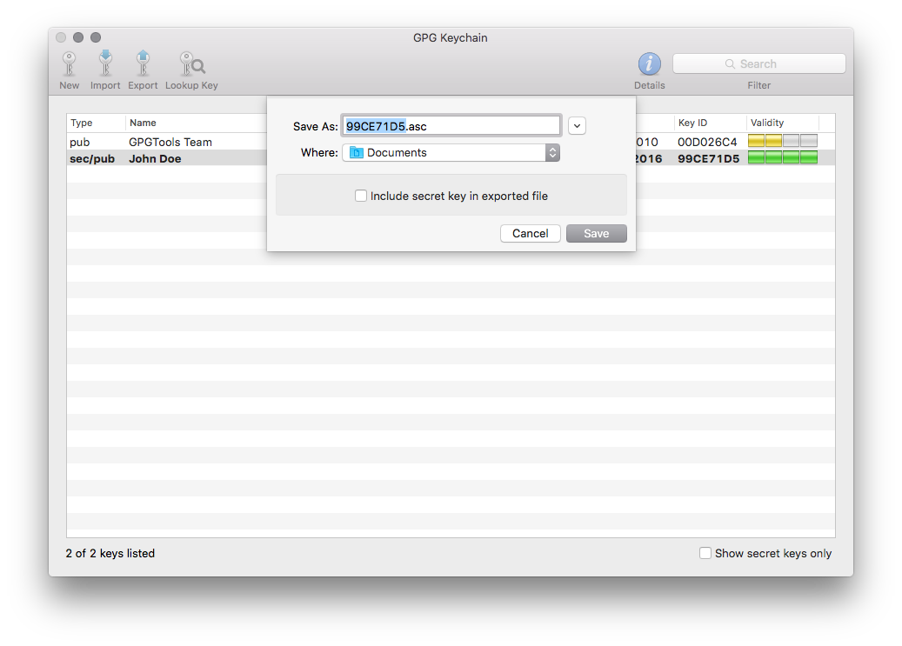

## What to do when you receive a public key

Public keys are shared in files with a `.asc` extension. If you receive a public key,  double-click on the file your received. _GPG Tools_ should automatically import the key for you. Once it has imported you can see the key inthe list of keys in _GPG Keychain_.

## Encrypting/decrypting files

You can use _GPG Tools_ to encrypt files or pieces of text (from emails or chat messages).

To keep things simple we are going to focus on encrypting and decrypting files only.

If you do have a piece of text (from a chat or email) that you wish to encrypt or decrypt you should save it into a text file first e.g. using _TextEdit_ on macOS like this example does:

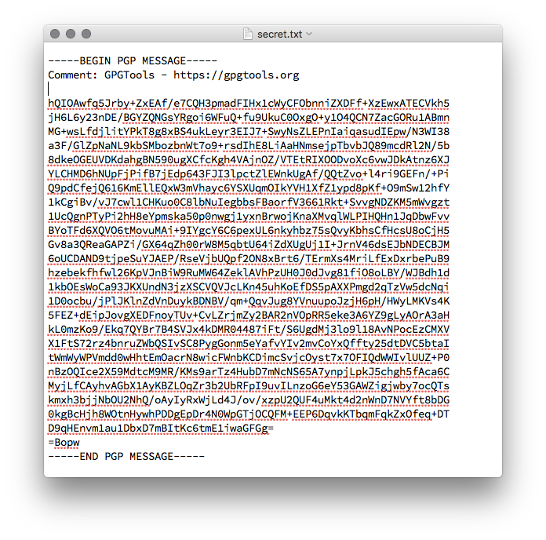

Check out our [Extra credit: encrypting/decrypting pieces of text]() section at the end if you regularly encrypt/decrypt pieces of text and want a faster workflow than making a new file for each piece of text.

### How to encrypt a file

This process will create an encrypted **copy** of a file - it will **not replace** the original with an encrypted version.

1. Save file on your local hard disk. If the encrypted message is part of an email or chat message copy and paste it into a plain text editor e.g. `TextEdit` and save that as a plain text file with the `.txt` extension.
1. Right-click on file, go to **Services** menu and choose **OpenPGP Encrypt file**
1. A _GPG Tools_ window will appear. Tick the public keys of everybody you want to be able to decrypt the file.
1. Make sure that "Add to Recipients" is ticked so that the file will also encrypt to your public key. Without this you will not be able to decrypt the file.

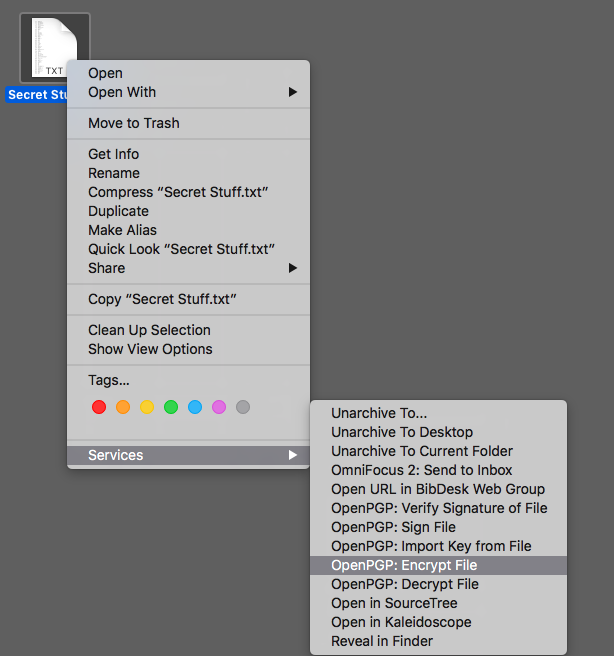
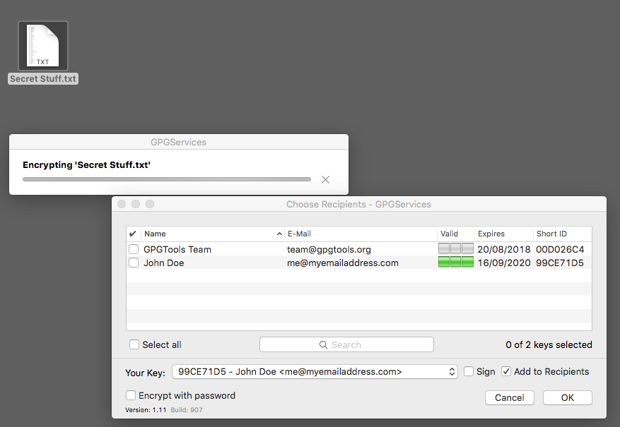
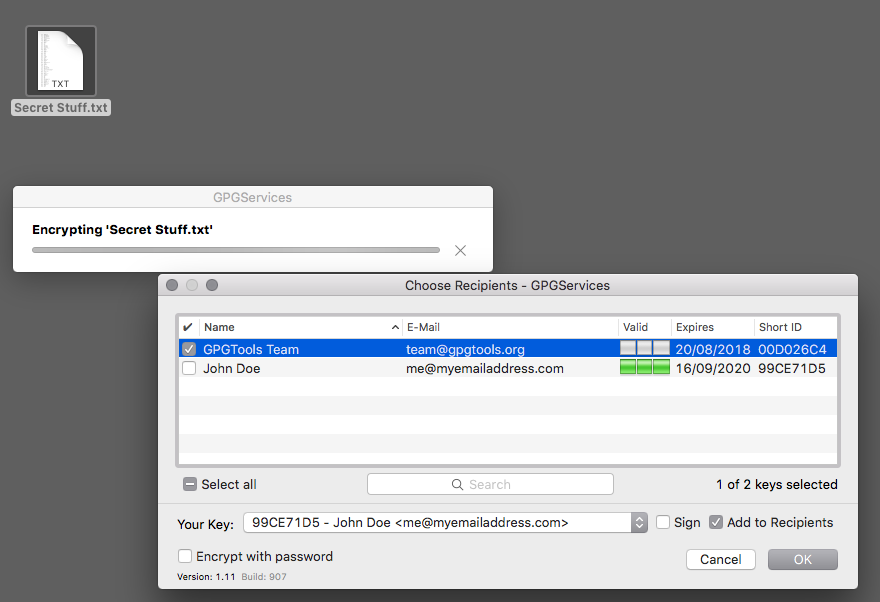

Once the encryption is complete (which should be very quick unless the file is very large) you will see this chipper little dialog box:

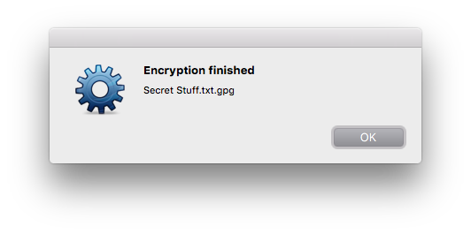

Now the directory should contain both the original and encrypted versions of the same file e.g.

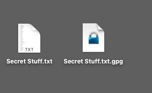

### How to decrypt an encrypted file

Hopefully the file is has a name which ends in `.gpg` e.g. `stuff.txt.gpg` If it does then you can just double-click it to make a decrypted copy in the same directory. You will be prompted for your secret key password (which unlocks your secret key which in turn decrypts the file).

If the filename does not end in `.gpg` and you are confident that it contains encrypted data then just rename it to end in `.gpg` e.g. rename `secret.jpg` to `secret.jpg.gpg` and double-click as before.

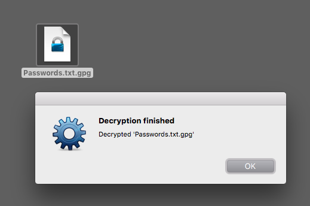
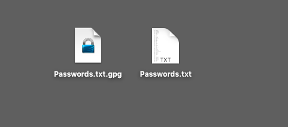

### Extra Credit: Encrypt/decrypt text without having to create a file

You don't need this section exchange encrypted messages with other people. We cover a technique which makes encrypting/decrypting small pieces of text quicker than making files.

1. Open an empty TextEdit document
1. Copy the encrypted text from your email/chat message/whatever into TextEdit
1. Select the encrypted text and right-click on it, choose **Services** from the menu and then choose **Encrypt selection** or **Decrypt selection** depending on which you wnat to do.
1. A _GPG Tools_ window will appear asking your to complete the encryption/decryption
1. The selected text will be **replaced** in the TextEdit document by the encrypted/decrypted version.

This workflow is handy if you regularly exchange small pieces of text e.g. passwords via slack or email.

