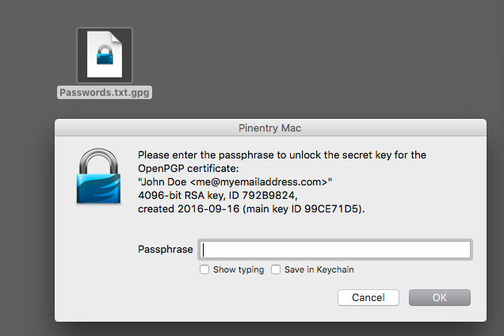

# Beginners guide for sending/receiving encrypted files on macOS

<!-- toc -->

- [Introduction](#introduction)
- [Overview of how encryption works](#overview-of-how-encryption-works)
- [Install GPG tools](#install-gpg-tools)
- [How to send your public key to somebody](#how-to-send-your-public-key-to-somebody)
- [What to do when you receive a public key](#what-to-do-when-you-receive-a-public-key)
- [Working with files](#working-with-files)
  * [How to encrypt a file](#how-to-encrypt-a-file)
  * [How to decrypt an encrypted file](#how-to-decrypt-an-encrypted-file)
  * [Extra Credit: Encrypt/decrypt text without having to create a file](#extra-credit-encryptdecrypt-text-without-having-to-create-a-file)

<!-- tocstop -->

## Introduction

## Overview of how encryption works

## Install GPG tools

then all your data is in ~/.gnupg
it also installs the command line tools

## How to send your public key to somebody

## What to do when you receive a public key

## Working with files

You can use _GPG Tools_ to encrypt files or pieces of text (from emails or chat messages).

To keep things simple we are going to focus on encrypting and decrypting files only.

If you do have a piece of text (from a chat or email) that you wish to encrypt or decrypt you should save it into a text file first e.g. using _TextEdit_ on macOS (show scr of textedit with encrypted content)

Check out our [Extra credit: encrypting/decrypting pieces of text]() section at the end if you regularly encrypt/decrypting pieces of text and want a faster workflow.

### How to encrypt a file

1. Save file on your local hard disk. If the encrypted message is part of an email or chat message copy and paste it into the TextEdit (show scr of both text edit and a chat window) and save that as a file first
1. Right-clic on file, go to Services menu and choose "OpenPGP Encrypt file"
1. Tick the public keys of everybody you want to send it to
1. also make sure the "Add to Recipients" is ticked so that it is also encrypted to your key

### How to decrypt an encrypted file

If the file is of the form `stuff.txt.gpg` just double-click it.

### Extra Credit: Encrypt/decrypt text without having to create a file

